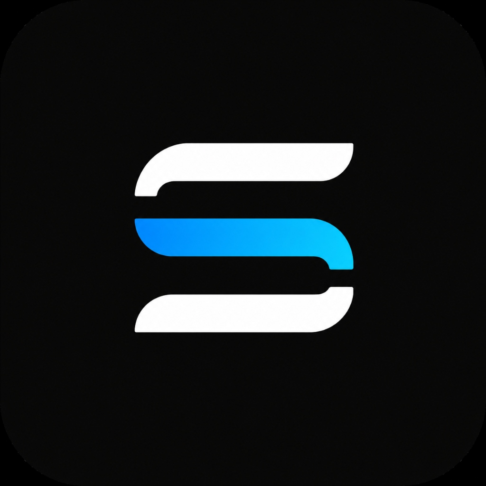

# S3 Bypass 🛡️

  

**S3 Bypass** — это минималистичный и мощный Android VPN-клиент, созданный специально для обхода самых жестких систем фильтрации трафика (DPI) и интернет-цензуры.

В отличие от классических VPN-протоколов, которые легко распознаются и блокируются, **S3 Bypass** использует нестандартный подход маскировки трафика через доверенные "белые списки" облачных провайдеров (в частности, AWS S3). 

  

## 📖 Технология

Приложение построено на базе модифицированного ядра **Xray / V2Ray**. 

Идея использования Amazon S3 и других облачных хранилищ из "белых списков" в качестве проксирующего слоя подробно описана в статье:
👉 **[Another way to bypass internet censors: White lists (S3)](https://www.linkedin.com/pulse/another-way-bypass-internet-censors-white-lists-vladislav-simonov-arrrf/)** *(Автор: Vladislav Simonov)*.

Благодаря этой архитектуре провайдеры видят ваш трафик как обычное легитимное обращение к популярным облачным сервисам, которые они не могут заблокировать без риска "положить" половину интернета.
## 🔌 Конфигурация

Готовые для подключения конфиги можно взять в Telegram-боте:
👉 **[@darkbitVPN_bot](https://t.me/darkbitVPN_bot)**

## 📄 Лицензия

Этот проект распространяется под свободной лицензией **[GNU GPL v3](LICENSE)**. Вы можете свободно копировать, изменять и распространять этот код (в том числе создавать форки) при условии сохранения указания авторства и обязательного сохранения исходного кода открытым (Open Source).

---
*Свободный интернет должен быть доступен каждому.*
