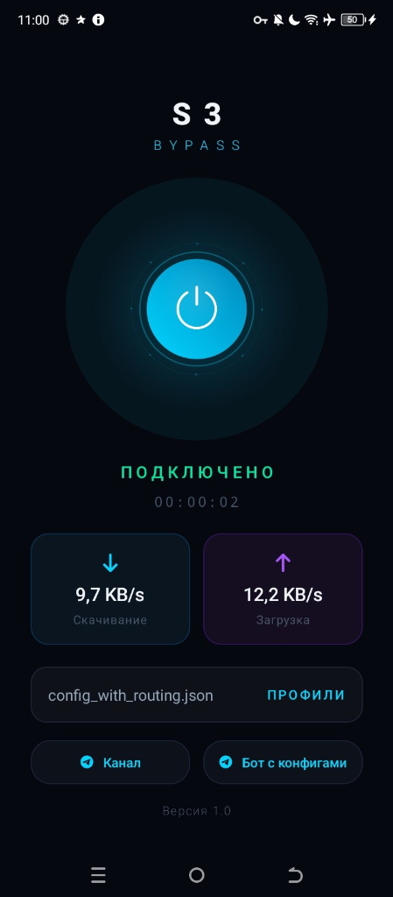
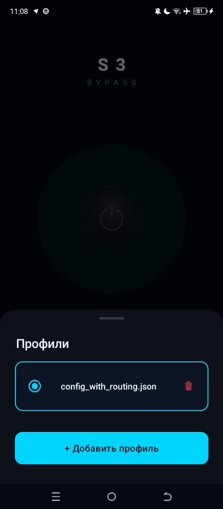

<p align="center">
  
</p>

<h1 align="center">S3 Bypass 🛡️</h1>

<p align="center">
  <strong>S3 Bypass</strong> — это минималистичный и мощный Android VPN-клиент, созданный специально для обхода интернет-цензуры в сетях с блокировками по принципу **белых списков** (когда весь интернет заблокирован, за исключением нескольких разрешенных доверенных ресурсов).
</p>

<p align="center">
  
  &nbsp;&nbsp;&nbsp;&nbsp;
  
</p>

## 📖 Технология

Приложение построено на базе модифицированного ядра **Xray / V2Ray** с поддержкой кастомного протокола передачи данных **`fedarisha`**.

В отличие от большинства VPN-решений, которые обфусцируют трафик при прямом подключении к прокси-серверу, **S3 Bypass вообще не устанавливает прямого соединения с вашим сервером**. 

В качестве транспортного канала используется любое **S3-совместимое объектное хранилище (например, Yandex Object Storage, VK Cloud S3, Selectel S3 и др.)**:
1. **Клиент** упаковывает трафик и записывает его в виде файлов-объектов в S3-корзину (bucket).
2. **Прокси-сервер** считывает эти файлы из корзины, выполняет запросы к целевым сайтам в открытом интернете и загружает ответы обратно в S3.
3. **Клиент** скачивает ответы из корзины и передает их локально приложениям на устройстве.

Поскольку клиент общается исключительно с IP-адресами выбранного S3-хранилища (которые находятся в «белых списках» провайдеров, например, доверенные облачные подсети Yandex, VK или Selectel), цензор видит это как стандартную работу с облачными дисками. Заблокировать такое соединение невозможно без отключения всей критической инфраструктуры этих облачных провайдеров.

Подробнее техническая концепция автора описана в статье:
👉 **[Another way to bypass internet censors: White lists (S3)](https://www.linkedin.com/pulse/another-way-bypass-internet-censors-white-lists-vladislav-simonov-arrrf/)** *(Автор: Vladislav Simonov)*.

## 🔌 Конфигурация

* **Готовые профили:** готовые для подключения конфиги можно взять в Telegram-боте 👉 **[@darkbitVPN_bot](https://t.me/darkbitVPN_bot)**.
* **Собственный сервер:** вы также можете развернуть собственный прокси-сервер по инструкции ниже.

---

## 🛠️ Развертывание собственного сервера

Для создания собственного туннеля через S3 вам понадобятся:
1. **VPS-сервер** за пределами зоны блокировок.
2. **Модифицированное ядро Xray-core** с поддержкой протокола `fedarisha`:
   👉 **[Fedarisha/Xray-core-fedarisha](https://github.com/Fedarisha/Xray-core-fedarisha)** (необходимо собрать и запустить на стороне сервера).
3. **S3-совместимое объектное хранилище** (например, Yandex Object Storage, VK Cloud S3, Selectel S3, AWS S3 и др.), чьи домены находятся в «белых списках» вашей сети.

### 1. Подготовка S3-хранилища
* Создайте аккаунт у S3-провайдера.
* Создайте новую корзину (bucket), например `vlt-alpha`.
* Выпустите ключи доступа (`Access Key ID` и `Secret Access Key`).

### 2. Настройка серверной части (VPS)
Запустите на вашем VPS-сервере бинарный файл **[Xray-core-fedarisha](https://github.com/Fedarisha/Xray-core-fedarisha)** с использованием следующего конфигурационного файла (`server_config.json`):

```json
{
  "log": {
    "loglevel": "info"
  },
  "inbounds": [
    {
      "tag": "fedarisha-in",
      "protocol": "fedarisha",
      "settings": {
        "tuning": {
          "idleTimeoutSec": 300,
          "pollIntervalMs": 100,
          "writeIntervalMs": 20,
          "maxFileSizeBytes": 2097152
        },
        "clients": [
          {
            "id": "4",
            "email": "demo-user-4",
            "level": 0
          }
        ],
        "storage": {
          "type": "s3",
          "bucket": "vlt-alpha",
          "prefix": "fedarisha/",
          "sessionsDir": "sessions",
          "region": "ru-msk",
          "endpoint": "https://ENDPOINT_S3_STORAGES.ru",
          "accessKey": "ACCESS_MASTER_STORAGE_KEY",
          "secretKey": "SECRET_MASTER_STORAGE_KEY"
        },
        "webhook": {
          "enabled": true,
          "listen": "0.0.0.0:80",
          "publicUrl": "http://IP_SERVER/webhook",
          "autoSetup": true
        }
      }
    }
  ],
  "outbounds": [
    {
      "tag": "direct",
      "protocol": "freedom",
      "settings": {}
    }
  ]
}
```

### 3. Настройка клиентской части (Android)
Для подключения через клиент **S3 Bypass** импортируйте JSON-файл конфигурации следующего формата:

```json
{
  "log": {
    "loglevel": "info"
  },
  "inbounds": [
    {
      "tag": "socks-in",
      "listen": "127.0.0.1",
      "port": 10808,
      "protocol": "socks",
      "settings": {
        "auth": "noauth",
        "udp": true
      }
    }
  ],
  "outbounds": [
    {
      "tag": "proxy",
      "protocol": "fedarisha",
      "settings": {
        "storage": {
          "type": "s3",
          "bucket": "vlt-alpha",
          "endpoint": "https://ENDPOINT_S3_STORAGES.ru",
          "region": "ru-msk",
          "prefix": "fedarisha/4/",
          "sessionsDir": "sessions",
          "accessKey": "ACCESS_KEY_USER_S3",
          "secretKey": "SECRET_KEY_USER_S3"
        },
        "tuning": {
          "idleTimeoutSec": 300,
          "pollIntervalMs": 100,
          "writeIntervalMs": 20,
          "maxFileSizeBytes": 2097152
        }
      }
    },
    {
      "tag": "direct",
      "protocol": "freedom",
      "settings": {}
    }
  ]
}
```

Подробное описание концепции и архитектуры решения приведено в [статье автора](https://www.linkedin.com/pulse/another-way-bypass-internet-censors-white-lists-vladislav-simonov-arrrf/).


## 📄 Лицензия

Этот проект распространяется под свободной лицензией **[GNU GPL v3](LICENSE)**. Вы можете свободно копировать, изменять и распространять этот код (в том числе создавать форки) при условии сохранения указания авторства и обязательного сохранения исходного кода открытым (Open Source).

---
*Свободный интернет должен быть доступен каждому.*
